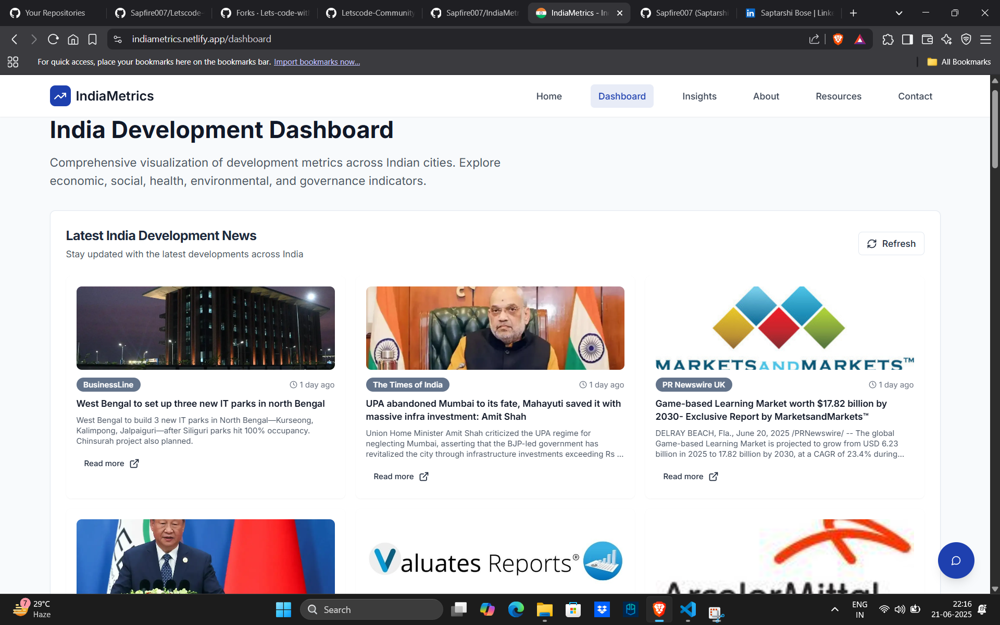
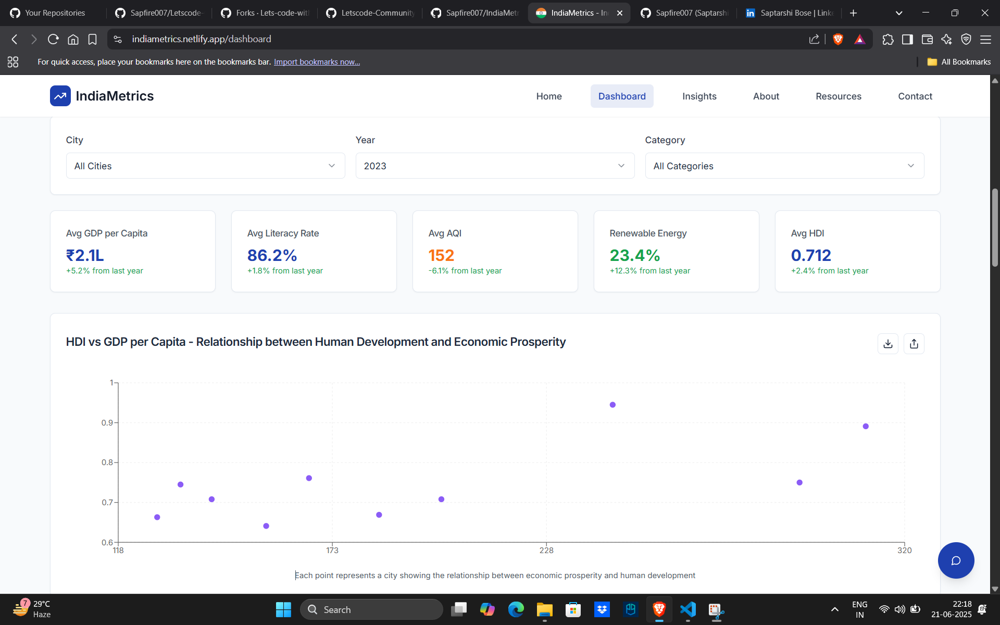
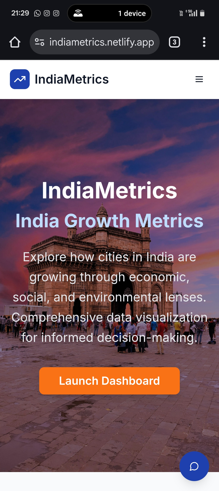
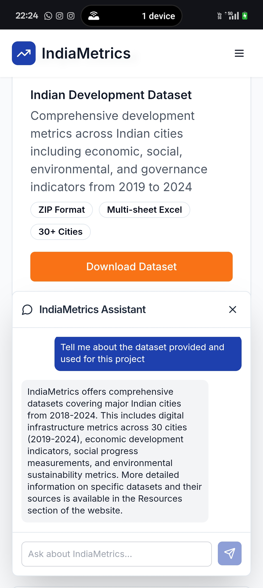

# IndiaMetrics
*Submitted by: Saptarshi Bose*

## 🌟 Live Demo
🔗 **[View Live Demo](https://indiametrics.netlify.app/)**

## 📸 Screenshots
## Dashboard Overview 

## Cities Comparison 

## Mobile view 


## 🛠️ Tech Stack
- Frontend: React, TypeScript, Vite, React Router DOM
- Backend: Supabase (Backend-as-a-Service)
- Database: Supabase
- Visualization: Recharts, react-india-states-map, html2canvas
- Deployment: Netlify

## ✨ Unique Features
- **[Feature 1]**: AI Chatbot: Gemini AI chatbot answers queries using the project's development data.
- **[Feature 2]**: Smooth Navigation: Custom animated page transitions give a seamless, app-like feel.
- **[Feature 3]**: Real-Time News Feed: Integrated News API shows live, India-focused development news alongside data.

## 🚀 Getting Started

### Prerequisites
- Node.js (v14+)

### Installation
```bash
# Clone the repository
git clone <repository-url>
cd indiametrics

# Install dependencies
npm install

# If faced issues installing (Recommended)
npm install --legacy-peer-deps

# Set up environment variables
cp .env.example .env.local
# Edit .env.local with your API keys

# Start development server
npm run dev

# Build for production
npm run build

# Preview production build
npm run preview
```