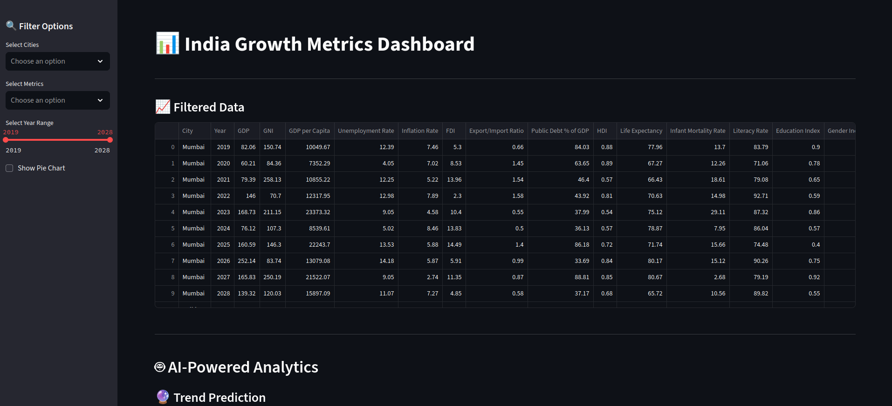
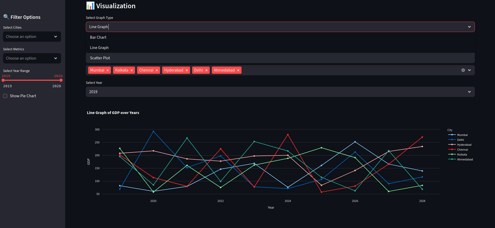
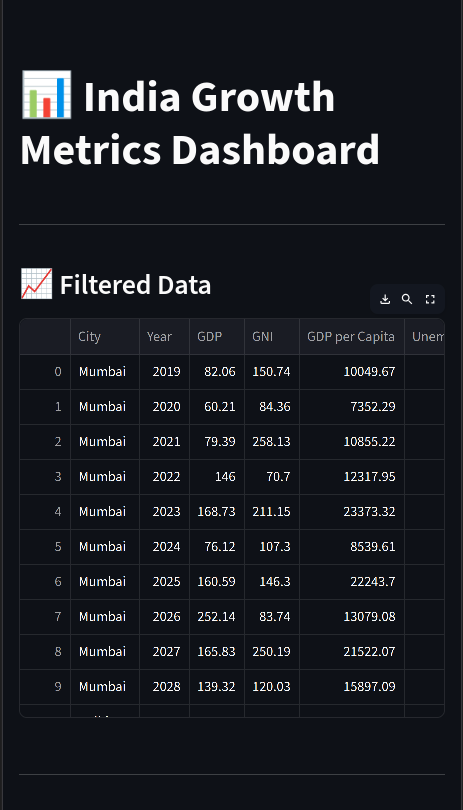

# India Growth Metrics Dashboard

_Submitted by: Raushan Bhanu_

## 🌟 Live Demo

🔗 **[View Live Demo](https://india-growth-metrics-dashboard.streamlit.app)**

## 📸 Screenshots

- **Dashboard Overview**



- **Cities Comparison**



- **Mobile View**



## 🛠️ Tech Stack

- **Frontend**: Streamlit (Python)
- **Database**: CSV (Pandas DataFrames)
- **Visualization**: Plotly, Seaborn, Matplotlib, Pydeck
- **Deployment**: Streamlit Cloud

## ✨ Unique Features

- **AI-Powered Analytics**: Trend prediction, anomaly detection, and correlation analysis across urban metrics.
- **Interactive City Mapping**: Visualizes metrics geospatially using scalable Pydeck markers.
- **Dynamic Data Exploration**: Customizable visualizations, comparisons, and filtering tools for city-wise insights.

---

## 🚀 Getting Started

### Prerequisites

- Python 3.8+
- Option 1: [`uv` package manager](https://github.com/astral-sh/uv)
- Option 2: Traditional `pip` and `requirements.txt`

---

### 🧩 Installation & Running the App

#### ✅ Option 1: Using `uv` (recommended)

```bash
# Step 1: Clone the repository
git clone https://github.com/RaushanBhanu/Letscode-Community-Challenge-1.git
cd Letscode-Community-Challenge-1/submissions/Raushan

# Step 2: Create and activate a virtual environment
uv venv
source .venv/bin/activate       # Linux/macOS
.venv\Scripts\activate          # Windows

# Step 3: Install dependencies using uv
uv sync

# Step 4: Generate mock data (if needed)
uv run generate_mock_data.py

# Step 5: Run the Streamlit app
streamlit run main.py
```

#### ✅ Option 2: Using `pip`

```bash
# Step 1: Clone the repository
git clone https://github.com/RaushanBhanu/Letscode-Community-Challenge-1.git
cd Letscode-Community-Challenge-1/submissions/Raushan

# Step 2: Install dependencies
pip install -r requirements.txt

# Step 3: Generate mock data (if needed)
python generate_mock_data.py

# Step 4: Run the app
streamlit run main.py
```